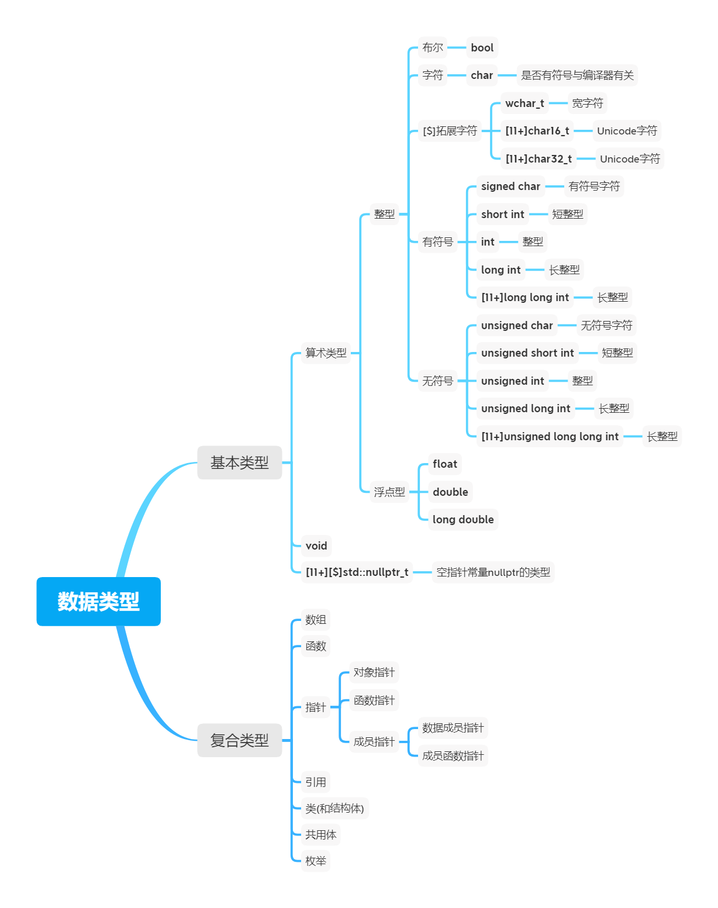

## 一.数据类型概览



## 二.typedef为类型定义别名

1.	使用方法
   typedef 后面接一个类似变量定义的语句，定义后这个语句的标识符就是别名。

```c++
typedef int INTEGER; //别名为INTEGER
INTEGER a;//a为int型

typedef int INT_ARRAY[10];//别名为INT_ARRAY
INT_ARRAY b;//b为int[10]型，即含10个元素的数组

typedef int (*ROW_PTR)[10];//别名为ROW_PTR
ROW_PTR c;//c为(*)[10]型，即行指针

typedef int (*FUNC_PTR)(int, int);//别名为FUNC_PTR
FUNC_PTR d;//d为int (*)(int, int)型，即两个参数为int，返回值也是int型的函数指针
```

2.	用处
   +	类型别名
   +	简化复杂类型声明

