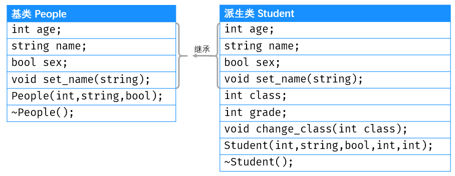

## 一.派生类的声明
```c++
class 类名 : 继承方式 基类名,... {};
```
其中，继承方式为 `public` `private` `protected`，默认为 `private`。

## 二.派生类的构成
+	派生类中的成员包括从基类继承过来的成员和自己增加的成员两大部分。每一部分均分别包括数据成员和成员函数。
+	**构造函数和析构函数不能从基类继承**。
	
	+	派生类可以访问基类的构造函数，来完成从基类继承的数据成员的初始化。
		
		>[warning] 派生类构造次序：基类构造函数 --> 对象成员构造函数 --> 派生类构造函数
	+	派生类不能访问基类的析构函数，但是派生类对象析构时，编译器 **先执行派生类的析构函数，再执行基类的析构函数** 。
+	继承自基类的数据成员的相对地址在前面，新增的数据成员的相对地址在后面。
+	对于 **多重继承** ，每个基类数据成员的整体位置取决于派生类声明时基类的顺序。

#### 例1 
下面是派生类 `Student` 与基类 `People` 的构成：



## \[11+\][$]三.禁止继承
在类名后面跟上一个 `final` 关键字可以防止其他类继承它:
```c++
class NoDerived final {};
```

## 四.基类成员在派生类的访问权限


+	继承自基类的成员函数内，成员权限仍然是基类的权限。
+	派生类新增的成员函数内，成员权限是派生类的权限。
+	派生类中 **不可访问** 表示 派生类内外均不可访问。

## 五.静态成员与继承
如果基类定义了一个静态成员，则在整个继承体系中只存在该成员的唯一定义。 即所有的派生类共用基类的静态成员。
