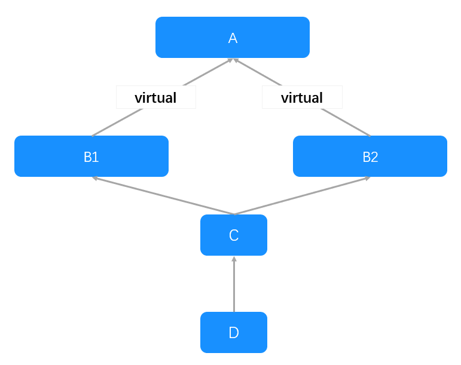

## 一.继承中的同名覆盖
1.	**重载** 局限于函数，而且需要通过参数和返回值来区分。
2.	**同名覆盖** 相同的名字出现在不同作用域中。对于函数，则是参数和返回值完全一样。在继承的情况下，派生类声明的同名成员覆盖基类声明的同名成员。
	
	>注意，这只是名字的覆盖，在对象的内存空间中，派生类声明的同名成员与基类的同名成员仍会占据不同的空间。
3.	**同名覆盖下访问基类的成员** 可以通过在成员名前加上基类作用域来访问隐藏的成员。

>[warning] 下面案例可运行在任意编译器上。
```c++
#include <iostream>
using namespace std;
struct Base
{
	int x_;
	Base(int x) :x_(x) {}
};
struct Derived : public Base {
	int x_;
	Derived(int x1, int x2) :Base(x1), x_(x2) {}
};

int main()
{
	Derived d(2,5);
	cout<<d.x_<<endl; //派生类同名成员覆盖基类同名成员
	cout<<d.Base::x_<<endl; //访问基类同名成员
	return 0;
}
```

>[test]
>5
>2

## 二.虚基类
### 1.虚基类的功能
>继承带来的一系列冲突和冗余问题：
>+	如果一个派生类有多个直接基类，而这些直接基类又有一个共同的基类，则在最终的派生类中会保留该间接共同基类数据成员的多份同名成员。
>+	在引用这些同名的成员时，必须在成员前增加基类作用域。

虚基类使得在继承间接共同基类时只保留一份成员。

### 2.虚基类的声明
在派生类声明时，为继承方式中添加 `virtual` 关键字。

### 3.最派生类
最派生类就是最后的派生类。即，创建类类型对象时，如果这个类有基类，则这个类就是最后的派生类。

当创建一个类类型对象时，编译器会从这个对象开始，查找其继承关系。如果有虚基类，则非最派生类在构造时，不会对基类进行构造，直到最派生类构造。

如果虚基类没有无参构造函数，则最派生类的构造函数需要在成员初始化器列表中加上虚基类的构造函数。

### 4.虚基类的浅层原理
微软的编译器(vc6和vs)引入了虚基类表指针。每个对象如果有一个或多个虚基类，就会由编译器安插一个指针，指向虚基类表。这个虚基类类表是一个数组，它有 `虚基类数目+1` 个元素。第一个元素为虚基类表指针在该派生类的偏移量，后面的元素则是虚基类相对于虚基类表指针位置的偏移量。

其他的编译器，则可能采用在虚函数表中放入虚基类偏移量的方法。

#### 例1
现在有下面5个类：
```c++
struct A
{
	int x_;
	A(int x) :x_(x) {}
};
struct B1 :virtual public A {
	int y1_;
	B1(int x, int y) :A(x), y1_(y) {}
};

struct B2 :virtual public A {
	int y2_;
	B2() :A(0), y2_(8) {}
};

struct C : public B1,public B2 {
	int z_;
	C(int x, int y,int z) :A(x),B1(x,y),B2(), z_(z) {}
};

struct D : public C {
	int w_;
	D(int x, int y,int z,int w_) :A(x),C(x,y,z), w_(z) {}
};
```
它们的继承关系树像这样：



当我们构造一个C类的对象，则C类就是最派生类。此时C类对象需要承担虚基类A的构造。
当我们构造一个D类的对象，则D类就是最派生类。此时D类对象需要承担虚基类A的构造。
当我们构造一个B1类的对象，则B1类就是最派生类。此时B1类对象需要承担虚基类A的构造。
当我们构造一个B2类的对象，则B2类就是最派生类。此时B2类对象需要承担虚基类A的构造。

#### 例2
```C++


struct A1
{
    int a;
    A1(int x=0) : a(x) {}
};

struct A2
{
    int b;
    A2(int x = 0) : b(x) {}
};

struct A3
{
    int c;
    A3(int x = 0) : c(x) {}
};

struct A4
{
    int d;
    A4(int x = 0) : d(x) {}
};

struct B :public A2, virtual public A4, public A3, virtual public A1
{
    int y2_;
    B(int x = 0) : y2_(x){}
};

int main()
{
    return 0;
}
```

使用 `Visual Studio` 打开上述代码，并在命令行选项中添加 `/d1 reportSingleClassLayoutB `，这样，在编译时，通过输出窗口可以看到 类B的内存布局：
```c
  class B	size(24):
  		+---
   0	| +--- (base class A2)
   0	| | b
  		| +---
   4	| +--- (base class A3)
   4	| | c
  		| +---
   8	| {vbptr}
  12	| y2_
  		+---
  		+--- (virtual base A4)
  16	| d
  		+---
  		+--- (virtual base A1)
  20	| a
  		+---
  B::$vbtable@:
   0	| -8
   1	| 8 (Bd(B+8)A4)
   2	| 12 (Bd(B+8)A1)
  vbi:	   class  offset o.vbptr  o.vbte fVtorDisp
           A4      16       8       4 		0
           A1      20       8       8 		0
```

上面的信息展示出了B的内存布局、虚基类表 `B::$vbtable@` 以及虚基类表的信息 `vbi` 。
在相对位置为 `8` 的位置有一个 `vbptr` ,它是虚基类表指针。再通过看虚基类表中，我们可以看到，第0个元素是虚基类相对于该派生类的偏移量，第1-2个元素则是相应虚基类的偏移量。

